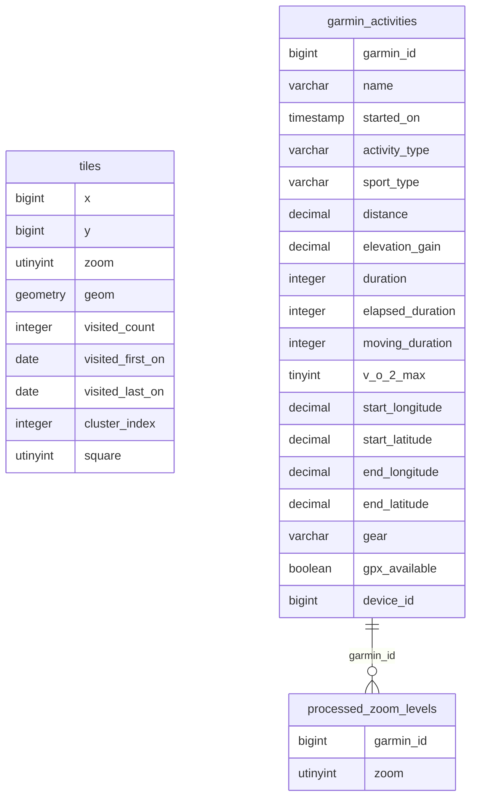

# Explorer the Earth… One tile at a time

## The backstory

I am on Strava since 2018, and an avid user of [Veloviewer](https://veloviewer.com) since 2021.
The latter is an outstanding service that provides great insights into your data, uploaded to Strava: Better charts, better aggregates, enriched views, you name it.

Veloviewer is also the service at which I learned about [tyle cycling](https://rideeverytile.com) and the large community of [Explorers](https://blog.veloviewer.com/meet-the-explorers/) behind it.
In short, the tiles are squares on a map and when one of your activities crosses a square it is counted as a tile.
If you cross the connected tile left, right, top and bottom of any tile too, that tile is counted as a cluster-tile.
The max square is based on the biggest square you can create with all the connected tiles.
That game appeals to many people, and other services appeared, like [Squadrats](https://squadrats.com), who use smaller tiles, better suited for cities and such.

What's the matter, then?
In November 2024 it became public that Strava will basically cripple their APIs for third party applications, read more about that at [DC Rainmaker](https://www.dcrainmaker.com/2024/11/stravas-changes-to-kill-off-apps.html).
For me, it feels that they want to get as much data as they can get, without giving back.
Don't get me wrong, Strava as a social place has been my happy place for quite some time now, but the service wrt to sports is getting worse every year.
Their challenges have been growing soft, and actually, hard to understand the last year (why do walks count as runs?!), the app became super annoying with the "edit me now for more engagement popup" after every new acitivity, and of course, they try to shove AI down our throats.
With the API changes ahead, I doubt that services like Veloviewer can survive, which is sad.

Sad, because I didn't want to do this all my self, but I just did create my own explore game:

https://biking.michael-simons.eu/explorer/

and I think it was the most joyful weekend programming exercise in a while.

If you are interested, follow me how I got there:

## What do I need?

### A home for this project

That would of course be [biking3](https://github.com/michael-simons/biking3).
I wrote about my setup [here](https://biking.michael-simons.eu/history/).
The current version is a 100% data-centric application, and the Python code around the database is as thin as possible and i want to keep it that way.
I picked [DuckDB](https://duckdb.org) as database, the whole API for the Python application are views.
Interaction with the database is cut down mostly to `FROM v_bikes` and similar.

### Raw activity data

My main hub for my data is actually not Strava.
It is [Garmin](https://connect.garmin.com).
Garmins devices are open, you can easily get the original activity files from the watches and bike-computers and there's plenty.
They also offer a GDPR-compliant download of all activity data in Europe and I wrote some tooling around that dubbed [garmin-babel](https://github.com/michael-simons/garmin-babel) a while ago.
That archive and the corresponding [GPX files](https://en.wikipedia.org/wiki/GPS_Exchange_Format) are my datasource.
I store the originals and their meta-data locally on my computer.

### Understanding of what a tile is

The tiles or squares are the backbone of every modern map server powering slippy maps and the algorithm to go from a geographic coordinate to a tile is well-defined in the [OpenStreetMap wiki](https://wiki.openstreetmap.org/wiki/Slippy_map_tilenames).
I felt like I would need functions going from a location to a tile and back quite often: While doing computations, ad-hoc queries and in views.

This is how you can write such functions in DuckDBs SQL variant:

```sql
CREATE OR REPLACE FUNCTION f_get_tile_number(p, z) AS (
    SELECT {
        x: CAST(floor((st_x(p) + 180) / 360 * (1<<z) ) AS integer),
        y: CAST(floor((1 - ln(tan(radians(st_y(p))) + 1 / cos(radians(st_y(p)))) / pi())/ 2* (1<<z)) AS integer),
        zoom: z
    }
);

CREATE OR REPLACE FUNCTION f_make_tile(tile) AS (
    SELECT
        ST_Reverse(ST_Extent_Agg(ST_Point(
            (tile['x'] + h[1]) / pow(2.0, tile['zoom']) * 360.0 - 180,
            degrees(atan(sinh(pi() - (2.0 * pi() * (tile['y'] + h[2])) / pow(2.0, tile['zoom']))))
        ))) FROM (SELECT unnest([[0, 0], [1, 0], [1, 1], [0, 1], [0, 0]]) as h)
);
```

Of course, I wrote them in such a way that the output of one can be used as input of the next.
There are already some nice things to spot

* I used `struct` datatypes, that can be defined ad-hoc
* DuckDB has complete support for maths, including bit-shifts
* Anyone familar with spatial programming notices `ST_xxx` functions: Those come with the [DuckDB spatial extension](https://duckdb.org/docs/extensions/spatial/functions.html), most of them are based on GDAL
* Inside `f_make_tile` I start with a tile number and move it to its for neighbours, applying the algorithm to go from index to coordinate, creating a `POINT` geometry
* As I use `unnest`, unnesting a list of 5 pairs of offsets, I would get back 5 rows with a point each. However, `ST_Extent_Agg` will aggregate them and compute a minimum bounding box around
* I needed to apply `ST_Reverse` to make the geomtry follow the [right-hand-rule](https://en.wikipedia.org/wiki/Right-hand_rule)

## My algorithm

The following ER-diagram shows the tables I am going to work on:



`garmin_activities` has a flag if a `GPX` file is available and `processed_zoom_levels` stores for each zoom level whether that file has been processed for the given zoom level.
`tiles` will store all tiles I came across in any activity.
The primary key will be `(x, y, zoom)` of course.
The geometry column is redundant, but it spares me some CPU cycles computing it later again.
The `visited_` columns are a bit of meta-data.
`cluster_index` and `square` are the relevant bits I want to fill.

The program doing the computation is written in Java, but be not afraid: It is little Java, and does not require much.
You find it here: [create_tiles.java](https://github.com/michael-simons/biking3/blob/main/bin/create_tiles.java), it can be run with [JBang!](https://www.jbang.dev).

### Computing squares

Originally I thought about computing the minimum bounding box for each activity, compute all possible tiles in there and then for each of the tiles check if it intersects the activities track.
Turns out, just taking all waypoints of a track, computing the tile at that point and do a `DISTINCT` on it, is enough.
In [`processNewActivities`](https://github.com/michael-simons/biking3/blob/559020f88863cd32057bc6fb257823984246443c/bin/create_tiles.java#L135) I take all unprocessed activities and just select distinct all tiles they come across:

```sql
WITH meta AS (
    SELECT ? AS zoom, ? AS garmin_id
),
new_tiles AS (
    SELECT DISTINCT meta.garmin_id, f_get_tile_number(geom, meta.zoom) AS tile
    FROM st_read(?, layer = 'track_points'), meta
)
INSERT INTO tiles BY NAME
SELECT tile.x,
       tile.y,
       tile.zoom,
       f_make_tile(tile) AS geom,
       1 AS visited_count,
       started_on::date AS visited_first_on,
       started_on::date AS visited_last_on,
FROM new_tiles JOIN garmin_activities USING(garmin_id)
ON CONFLICT DO UPDATE SET
    visited_count = visited_count + 1,
    visited_first_on = least(visited_first_on, excluded.visited_first_on),
    visited_last_on = greatest(visited_last_on, excluded.visited_last_on);
```

The important parameters go into `ST_Read`, a table functions that turns any GDAL supported file into a table providing things: In this case all points in the `track_points` layer.
The rest? A simple `INSERT BY NAME` and a proper conflict handler to update my number of visits.

### Finding clusters

I am quite sure I did something similar during [AoC](https://github.com/michael-simons/aoc) in SQL, but I couldn't remember it anymore.
In the end I started reading about [Connected-component labeling](https://en.wikipedia.org/wiki/Connected-component_labeling) and [pixel connectivity](https://en.wikipedia.org/wiki/Pixel_connectivity).
Clusters in ride every tile are 4-connected.

I ended up with a straight-forward [depth-first search](https://en.wikipedia.org/wiki/Depth-first_search) for tiles fulfilling the 4-connected criteria.
The code is here: [`findClusters0`](https://github.com/michael-simons/biking3/blob/559020f88863cd32057bc6fb257823984246443c/bin/create_tiles.java#L257-L289)
A tile has neighbours if the neighbours are in the dataset.

After I have labelled every cluster, I normalize the labels onto zero and store them as `cluster_index` with the tiles.
Retrieving than the biggest cluster is matter of 5 lines SQL:

```sql
SELECT zoom, count(*) AS num_tiles, round(ST_Area_Spheroid(ST_FlipCoordinates(ST_Union_Agg(geom))) / 1000000, 2) AS 'Area in km^2'
FROM tiles
WHERE cluster_index <> 0
GROUP BY cluster_index, zoom
QUALIFY dense_rank() OVER (PARTITION BY zoom ORDER BY num_tiles DESC) = 1
```

### Finding squares

The space optimized [dynamic programming](https://www.enjoyalgorithms.com/blog/introduction-to-dynamic-programming) solution from [Geeks for Geeks](https://www.geeksforgeeks.org/maximum-size-sub-matrix-with-all-1s-in-a-binary-matrix) seems to be appropriate.
Starting from the south-east, it will end up at the tile in the north-west from which the biggest square can be reached.
I was lazy, I just used [this and adapted it](https://github.com/michael-simons/biking3/blob/559020f88863cd32057bc6fb257823984246443c/bin/create_tiles.java#L344-L381) to give me back not only the number, but the coordinates at which the square starts.
But how to get the matrix?

Just pivot the hell out of all tiles, thank Duck…

```sql
PIVOT (
  SELECT x, y, concat(x, ',', y, ',', zoom) as f FROM tiles
) ON y using(any_value(f)) ORDER BY x
```

A limited result would look like this:

|  x   |     5479     |     5502     |     5503     |
|-----:|--------------|--------------|--------------|
| 8473 |              | 8473,5502,14 | 8473,5503,14 |
| 8474 |              | 8474,5502,14 | 8474,5503,14 |
| 8484 | 8484,5479,14 |              |              |

You notice that I don't put zeros or ones in the cells, but the tile numbers… No ambition to translate tile indexes back to 0-based array-indexes, including the holes in-between.
I can get the original position back from the cells value and just iterate over the rows and columns like this:

```java
var numColumns = result.getMetaData().getColumnCount();
var matrix = new String[rows][numColumns];

int row = 0;
while (result.next()) {
    for (int col = 0; col < numColumns; ++col) {
        matrix[row][col] = result.getString(col + 1);
    }
    ++row;
}
```

Let's see how much columns the DuckDB JDBC driver is able to handle eventually. 
However, I think if I reach a problem there, I can be happy: It means I really did travel far.
It's amazingly fast, both the full `PIVOT` and the search-algorithm.

## Putting it all together

[GeoJSON](https://geojson.org) is the easiest format to deal with in terms of getting spatial features on to a browser-based map and I am happy to be able to generate it straight at the source.
It's basically three views, [v_explorer_clusters](https://github.com/michael-simons/biking3/blob/559020f88863cd32057bc6fb257823984246443c/schema/api.sql#L488-L512), [v_explorer_tiles](https://github.com/michael-simons/biking3/blob/559020f88863cd32057bc6fb257823984246443c/schema/api.sql#L519-L539) and [v_explorer_squares](https://github.com/michael-simons/biking3/blob/559020f88863cd32057bc6fb257823984246443c/schema/api.sql#L546-L568).
For brevity, I just show the one giving the outline of the biggest 5 clusters.
The idea however is the same for all: Compute the single features, aggregate them into a list and return that as a feature collect:

```sql
WITH biggest_cluster AS (
    SELECT cluster_index, count(*) AS num_tiles, zoom, ST_Union_Agg(geom) t, dense_rank() OVER (PARTITION BY zoom ORDER BY num_tiles DESC) AS rnk
    FROM tiles
    WHERE cluster_index <> 0
    GROUP BY cluster_index, zoom
    QUALIFY rnk <= 5
),
features AS (
  SELECT {
      type: 'Feature',
      geometry: ST_AsGeoJSON(ST_ExteriorRing(t)),
      properties: {
        type: 'cluster',
        cluster: cluster_index,
        num_tiles: num_tiles
      }
  } AS feature, zoom
  FROM biggest_cluster
)
SELECT zoom, CAST({
  type: 'FeatureCollection',
  features: list(feature)
} AS JSON)
FROM features
GROUP BY zoom;
```

* The Common Table Expression (CTE) named `biggest_cluster` aggregates all tiles that are part of the 5 biggest clusters into one geometry with `ST_Union_Agg`
* In the `feature` CTE  a struct is defined that resembles a GeoJSON feature, with the `ST_ExteriorRing` of the union from the first step turned into a GeoJSON geometry representation
* The final select is just aggregation all features with `list` and then casting the nested structs into JSON
* In production, I do apply `ST_ReducePrecision` for each feature in the `features` CTE, to make the generated JSON a bit more handable

## Summary

Writing that small piece of software just for me was a joyful act driven by anger.
Anger about the enshittification of a service that now makes the lifes of small vendors like the people behind Veloviewer harder, and using the service for me a lot less fun.
Anger about all the cloud and AI we get, and the stuff that just fails us.
Joy because I could digg up some knowledge from the past and do some nice, domain-specific coding.
Joy because I really like the result and the representation (for which I used [Leaflet](https://leafletjs.com) and [js-colormaps](https://github.com/timothygebhard/js-colormaps) on [Thunderforest maps](https://www.thunderforest.com).
Cheers to [geo-activity-playground](https://github.com/martin-ueding/geo-activity-playground), for the nice idea of color-coding clusters, too.

I hope you enjoyed reading this small blog as much as I did writing this and the actual software.
